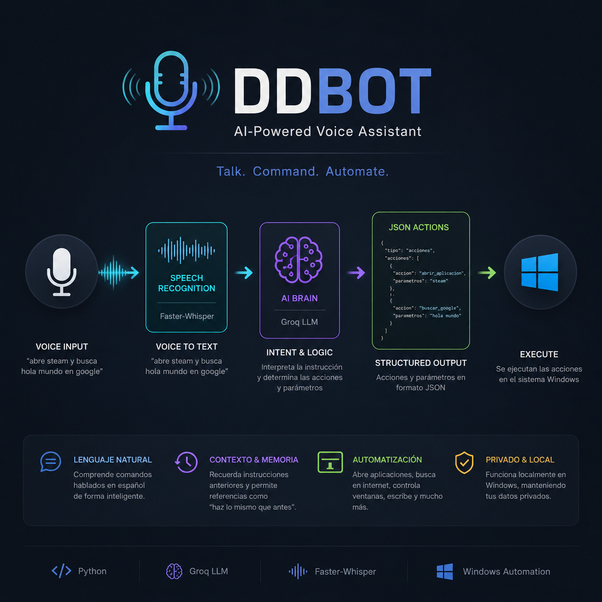

# DDBOT - AI Powered Voice Assistant
### Asistente de Voz Autónomo, Modular e Híbrido (Local / Nube) para Windows

<p align="center">
  
</p>

## 📝 Descripción
DDBOT es un asistente de voz avanzado desarrollado en Python que combina automatización local y una arquitectura modular basada en plugins con un **motor de procesamiento dual**. Puede operar de manera 100% privada y local utilizando **Ollama** o de forma ultraveloz en la nube mediante **Groq**.

El sistema utiliza un flujo optimizado: captura audio mediante control de actividad de voz (VAD), transcribe de forma local con **Faster-Whisper**, procesa la intención del usuario a través de un LLM devolviendo un plan estructurado en **JSON**, y finalmente ejecuta secuencias lógicas e independientes a bajo nivel en el sistema operativo.

El objetivo principal es explorar el desarrollo de **Agentes Autónomos Resolutivos** capaces de encadenar acciones complejas y expandir sus habilidades dinámicamente.

---

## 🚀 Características Clave
* **Procesamiento Dual Híbrido:** Soporte nativo para Inteligencia Artificial en la nube (Groq) o local sin internet (Ollama).
* **Escucha Activa con VAD (Voice Activity Detection):** Detección automática de silencio para cortar la grabación de forma inteligente cuando terminas de hablar.
* **Cerebro con Modelos de Visión:** Capacidad de sacar capturas de pantalla instantáneas y "ver" interfaces de usuario, explicar memes o auditar errores de código en tiempo real.
* **Planificación Multi-Acción Autónoma:** Capacidad de la IA para razonar y encadenar múltiples comandos secuenciales en una sola petición (ej. activar ventana, esperar, escribir y ejecutar combo).
* **Arquitectura de Plugins Modulares:** Sistema desacoplado que inyecta dinámicamente herramientas y reglas al prompt del sistema sin tocar el núcleo del código.
* **Feedback Auditivo Integral:** Tonos de notificación (*beeps*) nativos del sistema para estados de escucha y procesamiento.
* **Freno de Emergencia (Kill Switch):** Comando físico por teclado (`Ctrl+Shift+F10`) para detener procesos descontrolados instantáneamente.

---


## 🛠️ Arquitectura del Sistema

```text
  Micrófono (Entrada de Voz)
          │
          ▼
   Stream de Audio (VAD) ──► [Beep Inicio]
          │
          ▼
    Faster-Whisper (Transcripción Local) ──► [Beep Fin]
          │
          ▼
     Texto Limpio
          │
          ▼
   CEREBRO SELECCIONABLE ◄─── [Inyección Dinámica de Plugins / Reglas]
     ├──► MODO LOCAL: Ollama (Llama 3.3 / LLaVA)
     └──► MODO NUBE:  Groq Cloud (Llama 3.3 / LLaVA-Preview)
          │
          ▼
  JSON Plan de Acciones (Multi-acción / Auto-parámetros)
          │
          ▼
    Ejecutor Central
          │
          ├──► Plugins Internos (broma, volumen_manager, notas_manager, vision_manager)
          └──► Herramientas de Sistema (PyAutoGUI, PyGetWindow, Teclado)
          │
          ▼
   Acción Ejecutada en Windows
```
## 📂 Estructura del Proyecto
```
Plaintext
DDBOT/
│
├── MAIN.py                 # Núcleo del programa y atajos globales
│
├── utilidades/             # Módulos core de hardware y utilidades del sistema
│   ├── escucharNEW.py      # Stream de audio con VAD y Faster-Whisper
│   ├── hablar.py           # Motor de síntesis de voz (TTS)
│   ├── memoriaDinamica.py  # Sistema de persistencia contextual
│   ├── procesar.py         # Formateador de texto de entrada
│   └── Comandos.py         # Diccionarios de palabras clave y rutas fijas
│
├── UtilidadesConIA/        # Lógica de Inteligencia Artificial
│   ├── iaLocal.py          # NUEVO: Conector por defecto 100% Local (Ollama)
│   ├── iaGroq_onlineMode.py# Alternativa: Conector en la nube mediante API de Groq
│   ├── ejecutorIA.py       # Orquestador tolerante a fallos del plan de acción
│   └── herramientas.py     # Diccionario base TOOLS (ventanas, teclas, mouse)
│
├── plugins/                # Sistema Modular de Plugins Autónomos
│   ├── vision_manager.py   # ¡NUEVO! Ojos para el bot (Captura de pantalla + Análisis Visual)
│   ├── volumen_manager.py  # Control del mezclador de volumen de Windows (PyCaw)
│   ├── notas_manager.py    # Gestor de notas temporales con análisis de horario (Regex)
│   └── broma.py            # Módulo de entretenimiento
│
├── capturas/               # Almacenamiento local temporal de imágenes (Ignorado en Git)
├── docs/
│   └── ddbot-banner.png    # Recursos visuales del repositorio
│
├── requirements.txt        # Dependencias del entorno
└── README.md
```
## ⌨️ Ejemplos de Razonamiento Autónomo
```
1. Encadenamiento Secuencial Complejo
Usuario: "Abre steam espera tres segundos y pulsa alt mas f4"

JSON Plan de Acción:

JSON
{
  "tipo": "acciones",
  "acciones": [
    { "accion": "abrir_aplicacion", "parametros": "steam" },
    { "accion": "esperar", "parametros": "3" },
    { "accion": "tecla_combo", "parametros": "alt+f4" }
  ]
}
2. Visión Computacional Orientada a Contexto
Usuario: "Dime qué ves en mi pantalla"

Ejecución de la Acción: El asistente ejecuta analizar_pantalla. Python toma una captura de la interfaz actual, se la envía al modelo multimodal (llava o llama-vision) y describe de manera conversacional ventanas activas, errores de sintaxis en editores de código o imágenes en pantalla.
```

## 🔧 Instalación y Configuración
```
Clonar el repositorio:

Bash
git clone [https://github.com/DilanMartinez-Developer/DDBOT.git](https://github.com/DilanMartinez-Developer/DDBOT.git)
cd DDBOT
Instalar dependencias necesarias:

Bash
pip install -r requirements.txt
pip install pycaw comtypes ollama Pillow
Configurar el Modo de Inteligencia Artificial:

A) Modo Local (Por Defecto):

Descarga e instala Ollama.

Descarga los modelos de texto y visión ejecutando en tu consola:

Bash
ollama run llama3.3
ollama run llava
B) Modo Nube (Groq):

Si prefieres máxima velocidad sin consumir recursos de tu PC, configura el archivo iaGroq_onlineMode.py en tu núcleo de procesamiento.

Crea un archivo .env en la raíz del proyecto y añade tu API Key:

Fragmento de código
Groq_Api_KEY=TU_API_KEY_DE_GROQ
Ejecutar el asistente:

Bash
python MAIN.py
Presiona F10 para empezar a hablar o Ctrl+Shift+F10 en cualquier momento para el apagado de emergencia.
```

## 🗺️ Roadmap de Desarrollo
```
[x] Reconocimiento de voz local y optimización de audio (VAD)

[x] Integración con Groq Cloud LLM e IA Híbrida Local (Ollama)

[x] Sistema de automatización de ventanas y emulación de teclado

[x] Contexto conversacional y memoria de acciones

[x] Arquitectura Modular por Sistema de Plugins

[x] Plugin de Visión Integrado (¡Logrado!)

[ ] Implementación de OCR en pantalla para clics dinámicos sobre texto

[ ] Interfaz gráfica de usuario (GUI) interactiva
```

## 🎓 Objetivo Educativo
Este proyecto es un entorno de experimentación personal diseñado para profundizar en la integración práctica de Inteligencia Artificial Generativa con automatización nativa de sistemas operativos, procesamiento de señal de voz y desarrollo de agentes autónomos.


👤 Autor
Dilan Martínez - Estudiante de Ingeniería en Mecatrónica.

GitHub: @DilanMartinez-Developer
